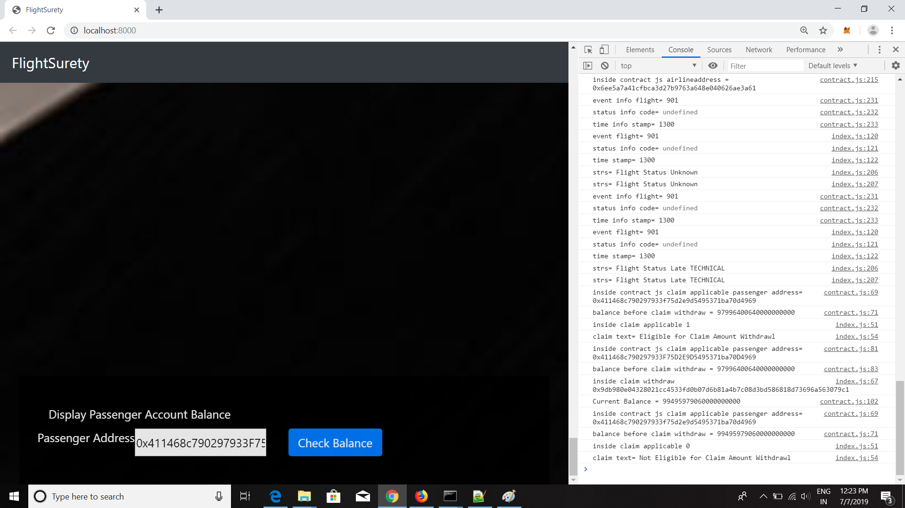

# FlightSurety: Flight Delay Insurance DAPP

## Concept:
This is a decentralized implementation of flight delay insurance. 
It consists of smart contract on Ethereum coupled with Oracles to provide auto claim disbursal to passengers in case of delay.

### Below are the key attributes

a. Managed as collaboration between multiple airlines

b. Passengers can purchase insurance prior to a Flight

c. If the flight is delayed to airline Fault, passengers are paid the 1.5 times the amount paid for insurance

d. Oracles provide flight status information into Smart Contract


### Architecture: is divided into on-chain & off-chain as below: 
Smart Contracts: are split into following two:

App Contract (Upgradable Business Logic)

Data Contract (Captures Persistent d data structures for Airline, Flight, Passenger & Insurance details.

Oracle: server application which will provide flight status to smart contract

DAPP Client



## Actors

### Airline
Data structure for Airlines is defined in Data Contract. The first airline is registered in the constructor of the APP Contract.The address of the first airline will be APP Contract Owner.

Business Rules:
Registering New Airline:
1. Only Existing Airline can register a new Airline until there are atleast 4 airlines registered.
2. Multi Party Consensus: Registration of Fifth & subsequent Airline requires multi-party consensus of 50% of registered airlines

### Flight
Flight ID's are hard coded as: "901,902,903"
Flight Time are hard coded as: "1300,1400,1500"


### Insurance
*  A passenger can buy insurance by selecting the flight id & Flight schedule.
*  A passenger needs to pay upto 1 ether to buy insurance


## Oracles 
Oracles are used to provide flight status information (i.e. external data ) into smart contract.
Multiple oralces are registred with Smart Contract to decentralize trust. Oracles are implemented as server application.
Register Oracle: 20+ oracles are initiated at project start-up and register with Smart Contract

Flight Status Request Event: is trigerred through DAPP UI, interacts with smart contract and generates request to Oracle to fetch flight status. In real tme scenario, it would be an API notifying the oracle for delay in flight.

After consensus is acheived on Flight Status by two oracles, the request is closed. If the Status of the flight is delayed , then all passengers who had purchased the insurance for the flight
are marked as "Eligible for Payout


### Check Claim Status

The passengers, who had purchased insurance for the flight which got delayed based on response of flight status have been marked for payout. The status of their Claim can be check through DAPP, with button "Check Claim Applicable"


### Withdrawl

The passengers, who had been marked as eligible for Payout can withdraw claim amount to their wallet. This can be done by clicking on button "Withdraw Claim"
This method will transfer "1.5" ether to passenger account and reset passenger status to "Not eligible for payout"


## Install

Change directory to the ```flight-surety``` folder and install all requisite npm packages (as listed in ```package.json```):''

```
cd flight-surety
npm install

compile and deploy on local ganache

truffle migrate --reset
```


versions:
Truffle v4.1.15 (core: 4.1.15)

Node Version
v10.15.3

Solidity v0.4.25 (solc-js)


### Develop Client

To run truffle tests:

`truffle test ./test/flightSurety.js`
`truffle test ./test/oracles.js`

To use the dapp:

`truffle migrate`
`npm run dapp`

To view dapp:

`http://localhost:8000`

## Develop Server

`npm run server`
`truffle test ./test/oracles.js`

## Deploy

To build dapp for prod:
`npm run dapp`


